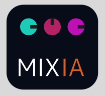
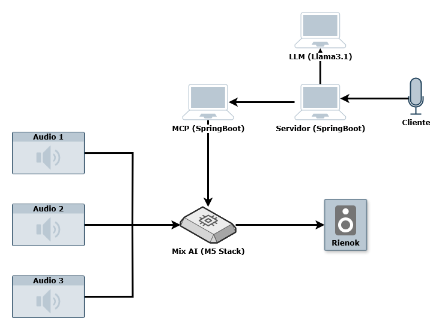

<div align="center">

</div>
<h1 align="center">🚀 MIX AI</h1>

---

## Estructura del Repositorio
```bash
/assets/                 # Recursos visuales y documentales (imágenes, diagramas, PDFs, etc.)
/volume-api/             # Proyecto backend en Spring Boot que expone una API RESTful con integración de chat
/volume-mcp/             # Implementación del Model Context Protocol (MCP) en Spring Boot
/prototypes/             # Códigos experimentales o pruebas descartables para referencia futura
README.md                # Descripción general del proyecto
```

## Información del Proyecto
- **Jeffry Valverde** – Coordinador General, responsable de AI & IoT. GitHub: [JeffryVF](https://github.com/JeffryVF)
- **Joaquín Pappa** – Coordinador de Desarrollo Back-end & IoT. GitHub: [Joaco2603](https://github.com/Joaco2603)
- **Dylan Josue** – Coordinador de Desarrollo Front-end. GitHub: [Djch18](https://github.com/Djch18)
- **Andrés Calvo** – Coordinador de Procesos y Gestión de Proyecto. GitHub: [AndresACV](https://github.com/AndresACV)

## Descripción y Justificación
- **Problema que se aborda:**  
Muchos músicos no tienen conocimientos técnicos de mezcla de sonido o configuración de sistemas de audio complejos. Esto dificulta su capacidad para presentarse en vivo o transmitir sin depender de técnicos especializados.

- **Importancia y contexto:**  
Existen mezcladoras y software complejos, pero pocos dispositivos accesibles que permitan controlar el sonido mediante lenguaje natural. El proyecto busca facilitar la vida de músicos y creadores al permitir que puedan ajustar su sonido simplemente con comandos de voz o texto.

- **Usuarios/beneficiarios:**
    -  Músicos (profesionales y amateurs)
    - Técnicos de sonido en eventos pequeños
    - Creadores de contenido musical
    - Escuelas de música y estudios caseros

## Objetivos del Proyecto
- **Objetivo General:**
Desarrollar una mezcladora de audio inteligente potenciada por un modelo de lenguaje (LLM), que permita a los usuarios modificar configuraciones de sonido usando lenguaje natural.
- **Objetivos Específicos:**  
    - Integrar un microcontrolador con sensores y módulos de audio.
    - Establecer comunicación entre el hardware y una LLM para interpretar comandos.
    - Diseñar una interfaz simple y accesible para el usuario.
    - Conectar el LLM con un MCP para facilitar la compresión del lenguaje natural.

## Requisitos Iniciales
- Lista breve de lo que el sistema debe lograr:  
  - Interpretar comandos de audio en lenguaje natural. 
  - Controlar niveles de salida y efectos de sonido en tiempo real.
  - Tener una interfaz física o digital intuitiva.


## Diseño Preliminar del Sistema
- **Arquitectura:**  


- **Componentes previstos:**  
  - Microcontrolador: ESP32 M5 V1.11
  - Microcontrolador: Ideaboard
  - Parlante: Rienok 
  - Cable de audio: Jack 3.5
  - Modulo: PCM5102
  - LLM/API: Local Llama3.1

  - Este proyecto está bajo la licencia [Creative Commons Attribution-NonCommercial 4.0 International (CC BY-NC 4.0)](https://creativecommons.org/licenses/by-nc/4.0/).
