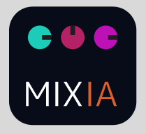
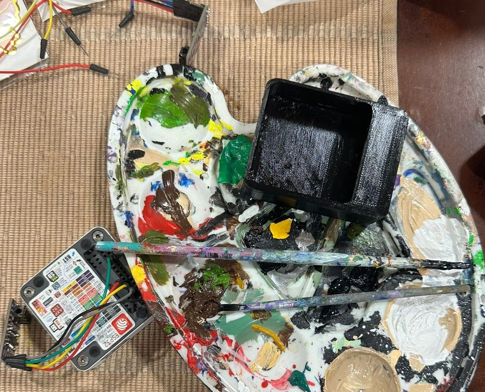
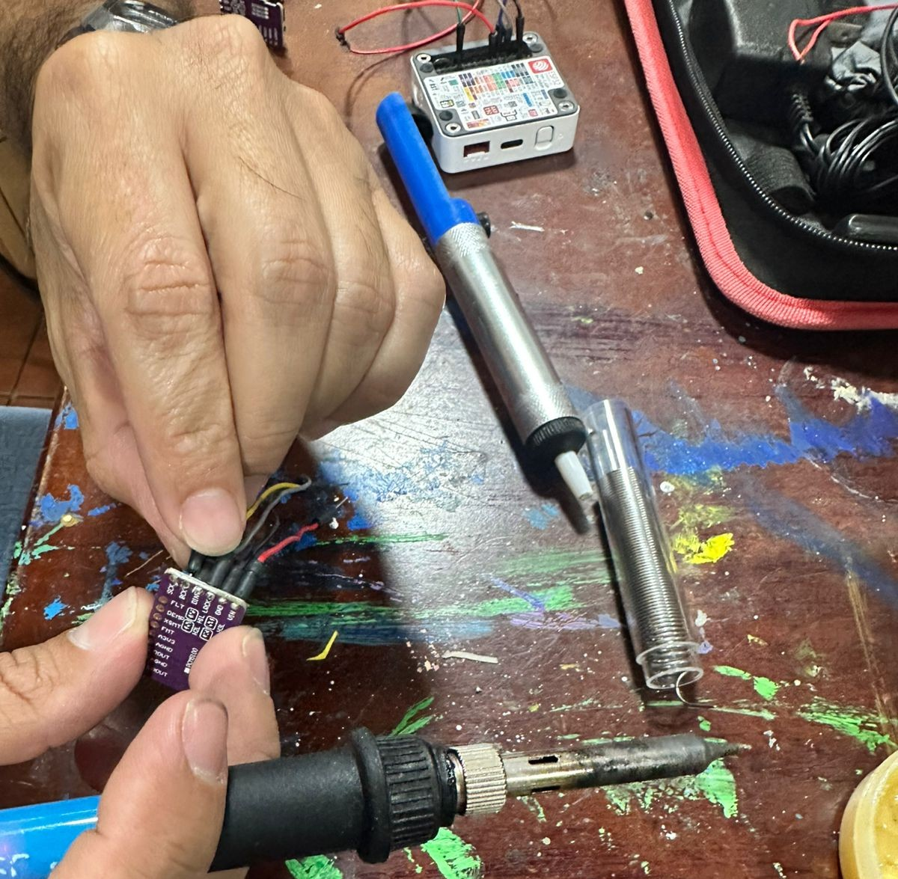
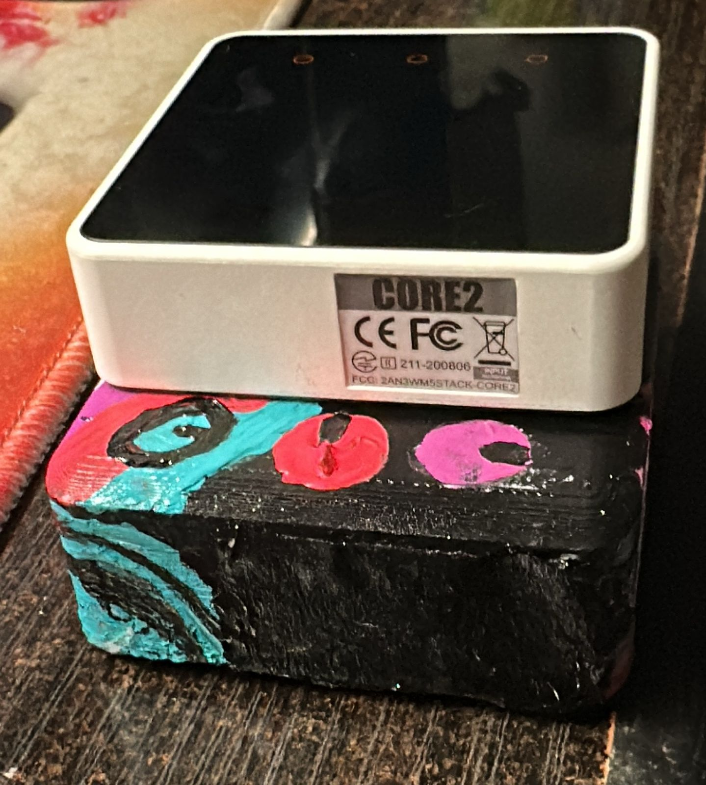
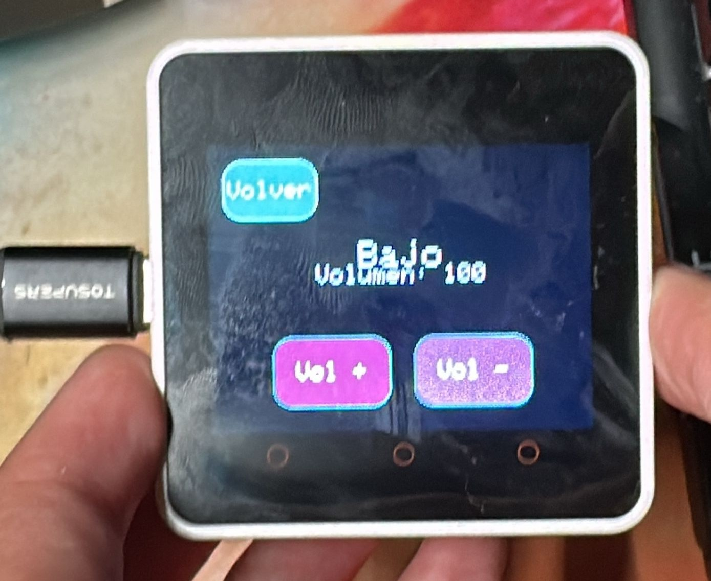
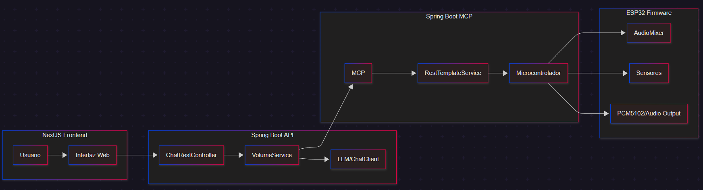
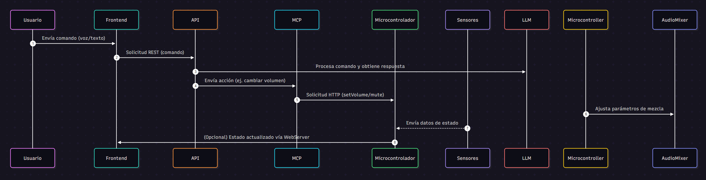
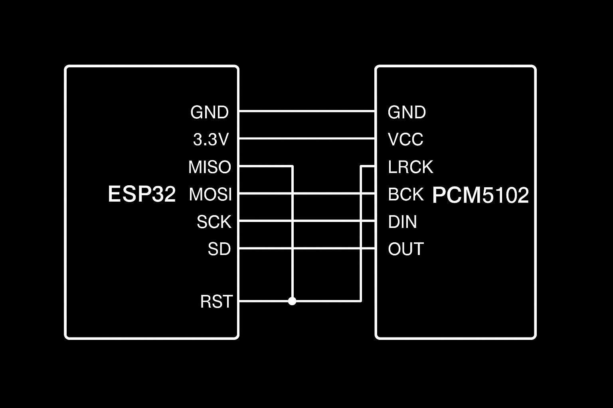

<h1 align="center">MIX IA</h1>

## Demostración de Funcionamiento (haz click en el logo)
<div align="center">
  <a href="https://drive.google.com/file/d/1fF2qV_4I3gQiNyiULuws_Qy0VWonrJZW/view?usp=drivesdk">
    
  </a>
</div>


## Estructura del Repositorio
```text
/docs/                   # Documentación extendida: diagramas (arquitectura/flujo), notas técnicas y PDFs
/hardware/               # Esquemas eléctricos, diagramas de conexión, archivos CAD/3D (piezas impresas) y PCB
/software/               # Código fuente principal: firmware (ESP32), backend (volume-api, volume-mcp), frontend-client
/models/                 # Prompts, configuraciones y artefactos relacionados con LLM (Gemini / adaptadores locales)
/tests/                  # Pruebas unitarias e integraciones (backend, MCP, frontend y mock firmware)
/examples/               # Ejemplos reproducibles: curl, scripts de demo y casos de uso (shortcuts de comandos)
README.md                # Descripción general del proyecto (este fichero)
ARCHITECTURE.md          # Documentación detallada de la arquitectura y decisiones de diseño
SETUP.md                 # Guía de instalación y despliegue (entornos local / producción)
CONTRIBUTING.md          # Normas y plantillas para colaborar (PRs, Issues, pruebas)
LICENSE                  # Licencia del proyecto (Creative Commons / otros)
CHANGELOG.md             # Registro de cambios y versiones
```

## Wiki

Documentación extendida y guías: https://deepwiki.com/Joaco2603/Mix_AI

## Dónde empezar

- Quick start y pasos para ejecutar el sistema: `SETUP.md`.
- Documentación técnica y decisiones de diseño: `ARCHITECTURE.md`.
- Historial de cambios y versiones: `CHANGELOG.md`.
- Cómo contribuir (PRs / Issues / normas): `CONTRIBUTING.md`.
- Licencia del proyecto: `LICENSE`.

## Información del Proyecto
- **Jeffry Valverde** – Coordinador General, responsable de AI & IoT. GitHub: [JeffryVF](https://github.com/JeffryVF)
- **Joaquín Pappa** – Coordinador de Desarrollo Back-end & IoT. GitHub: [Joaco2603](https://github.com/Joaco2603)
- **Dylan Josue** – Coordinador de Desarrollo Front-end. GitHub: [Djch18](https://github.com/Djch18)
- **Andrés Calvo** – Coordinador de Procesos y Gestión de Proyecto. GitHub: [AndresACV](https://github.com/AndresACV)

## Descripción y Justificación
- **Problema que se aborda:**  
Muchos músicos no tienen conocimientos técnicos de mezcla de sonido o configuración de sistemas de audio complejos. Esto dificulta su capacidad para presentarse en vivo o transmitir sin depender de técnicos especializados.

- **Importancia y contexto:**  
Existen mezcladoras y software complejos, pero pocos dispositivos accesibles que permitan controlar el sonido mediante lenguaje natural. El proyecto busca facilitar la vida de músicos y creadores al permitir que puedan ajustar su sonido simplemente con comandos de voz o texto.

- **Usuarios/beneficiarios:**
    -  Músicos (profesionales y amateurs)
    - Técnicos de sonido en eventos pequeños
    - Creadores de contenido musical
    - Escuelas de música y estudios caseros

## Objetivos del Proyecto
- **Objetivo General:**
Desarrollar una mezcladora de audio inteligente potenciada por un modelo de lenguaje (LLM), que permita a los usuarios modificar configuraciones de sonido usando lenguaje natural.
- **Objetivos Específicos:**  
    - Integrar un microcontrolador con sensores y módulos de audio.
    - Establecer comunicación entre el hardware y una LLM para interpretar comandos.
    - Diseñar una interfaz simple y accesible para el usuario.
    - Conectar el LLM con un MCP para facilitar la compresión del lenguaje natural.

## Requisitos Iniciales
- Lista breve de lo que el sistema debe lograr:  
  - Interpretar comandos de audio en lenguaje natural. 
  - Controlar niveles de salida y efectos de sonido en tiempo real.
  - Tener una interfaz física o digital intuitiva.

- **Componentes:**
  
  - Microcontroladores usados:
    - ESP32 M5Stack Core2 (M5Stack Core2 V1.1) — hardware principal del firmware y la interfaz táctil. Más info: https://docs.m5stack.com/
    - Ideaboard — placa adicional usada en algunos prototipos (variante ESP32/Arduino).

  - Sensores / Actuadores / Periféricos:
    - Módulo DAC PCM5102 (I2S) — salida de audio para altavoz externo. Datasheet: https://www.ti.com/lit/ds/symlink/pcm5102a.pdf
    - Parlante (Rienok) — altavoz conectado a la salida del DAC.
    - Cable de audio jack 3.5 — para salida analógica/conexiones externas.
    - Tarjeta SD / almacenamiento (usado por `WavReader` / `AudioPlayer`) — controlador SD: https://www.arduino.cc/reference/en/libraries/sd/
    - Interfaz táctil / botones del M5Stack Core2 (UI física) — ver docs M5Stack: https://docs.m5stack.com/

  - LLM empleado (cloud / local):
    - Gemini 2.5 Pro (cloud) — integrado vía Google Cloud / Vertex AI desde `volume-api`. Docs y guías: https://cloud.google.com/vertex-ai/docs/generative-ai
    - (Opcional/local) Soporte para LLM local — el diseño permite usar alternativas locales (por ejemplo Llama 3.x) si se adapta el `VolumeService`/cliente de chat.

  - Librerías clave (con documentación oficial):
    - ESP32 Arduino core — documentación oficial: https://docs.espressif.com/projects/arduino-esp32/en/latest/
    - Espressif I2S (I2S API para manejar PCM5102): https://docs.espressif.com/projects/esp-idf/en/latest/esp32/api-reference/peripherals/i2s.html
    - PlatformIO (entorno/gestor de proyectos para el firmware): https://platformio.org/
    - M5Stack / M5Core2 libraries (UI, display, touch): https://docs.m5stack.com/
    - Arduino SD library (lectura/escritura de WAV desde SD): https://www.arduino.cc/reference/en/libraries/sd/
    - Spring Boot (API & MCP services): https://spring.io/projects/spring-boot
    - Spring AI / Chat integrations (cliente de chat usado en `volume-api`): https://spring.io/projects/spring-ai
    - RestTemplate (cliente HTTP usado en `volume-mcp`): https://docs.spring.io/spring-framework/docs/current/javadoc-api/org/springframework/web/client/RestTemplate.html
    - Biblioteca de audio I2S incluida (repositorio local): `microcontroller-firmware/lib/ESP32-audioI2S/` — ver código incluido en el repo.

---

## Progreso del Proyecto

### 1. Modelo y impresión 3D


Se diseñó un modelo en TinkerCad utilizando las medidas del ESP32 y el PCM5102 para ocultar los cables. La pieza fue impresa en 3D.

## Link del Diagrama de la Pieza 3D:
https://www.tinkercad.com/things/dmCiIZABGQX-brilliant-kieran-snicket/edit?returnTo=https%3A%2F%2Fwww.tinkercad.com%2Fdashboard&sharecode=J4qVyTr3OJeEgzTjWTHMvxQUkrp-lW0_cSCWPZfWp7A

### 2. Pintura inspirada en el logo


La pieza 3D se pintó inspirándose en el logo definido para el sistema ciberfísico.

### 3. Soldadura de componentes


Se soldó el PCM5102 a la ESP32 para conectar un altavoz externo.

### 4. Ensamblaje final


Vista del ESP32 con el PCM5102 soldado y pintado dentro de la pieza 3D.

### 5. Vista principal del proyecto


Vista principal del Proyecto MIXIA funcionando en el ESP32.

---

## Diagramas y Esquemas

### Diagrama de Arquitectura


El diagrama muestra la relación entre el Frontend (NextJS), la API (`volume-api`), el servidor MCP (`volume-mcp`) y el firmware del microcontrolador (ESP32). El flujo principal de comandos del usuario pasa por el Frontend hacia la API, que usa un cliente de chat (LLM) y solicita acciones al MCP para controlar el hardware.

### Diagrama de Flujo de Datos


Flujo de datos:

- Usuario → Frontend: el usuario envía comandos por voz o texto.
- Frontend → API (`/chat`): se realiza una petición REST con la instrucción.
- API → LLM/ChatClient: la API formatea la petición y consulta al LLM para interpretar o extraer la intención.
- API → MCP: si la intención requiere acción sobre hardware (ej. cambiar volumen, mute), la API invoca al MCP.
- MCP → Microcontrolador: el MCP llama al firmware del ESP32 (por HTTP o RPC definido) para aplicar cambios (setVolume, mute, etc.).
- Microcontrolador → Hardware: el firmware ajusta el `AudioMixer`, controla salidas (PCM5102) y recibe datos de sensores.
- Microcontrolador → Frontend (opcional): el WebServer en el firmware puede exponer estado para refrescar la UI.

### Esquema Eléctrico


Conexiones de pines entre ESP32 M5Stack Core2 V1.1, módulo DAC PCM5102, sensores y actuadores (parlante, botones, etc.).

⚠️ Nota importante sobre pines

Las conexiones mostradas en este diagrama aplican únicamente para el ESP32 M5Stack Core2 V1.1.
Este modelo de ESP32 ya trae expuestos los pines necesarios para trabajar con el DAC PCM5102 mediante la interfaz I2S:

- LRCK (WS) → Pin interno asignado como I2S_WS
- BCK (SCK) → Pin interno asignado como I2S_BCK
- DIN (DATA) → Pin interno asignado como I2S_DATA
- GND y 3.3V disponibles en los headers laterales.

Otros modelos de ESP32 o revisiones distintas del M5Stack pueden tener diferente mapeo de pines, por lo que este diagrama no es universal y debe adaptarse a la variante de hardware utilizada.

### 🎯 Funcionalidades Implementadas

- **Chat con IA**: Interacción en lenguaje natural con Gemini
- **Control de Volumen**: Ajuste de volumen por instrumento
- **Lista de Instrumentos**: Consulta de instrumentos disponibles
- **Scope Limitado**: Solo responde preguntas relacionadas con audio
- **Arquitectura MCP**: Comunicación entre servicios usando Model Context Protocol

---

  - Este proyecto está bajo la licencia [Creative Commons Attribution-NonCommercial 4.0 International (CC BY-NC 4.0)](https://creativecommons.org/licenses/by-nc/4.0/).
